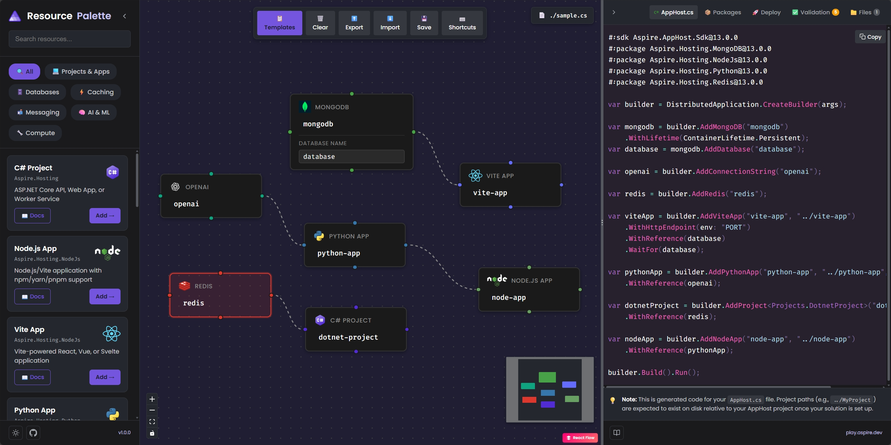
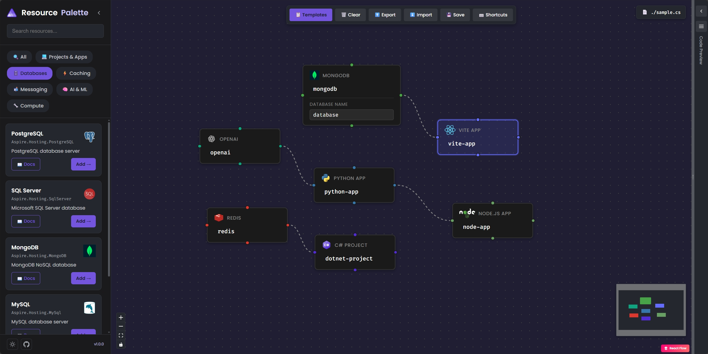
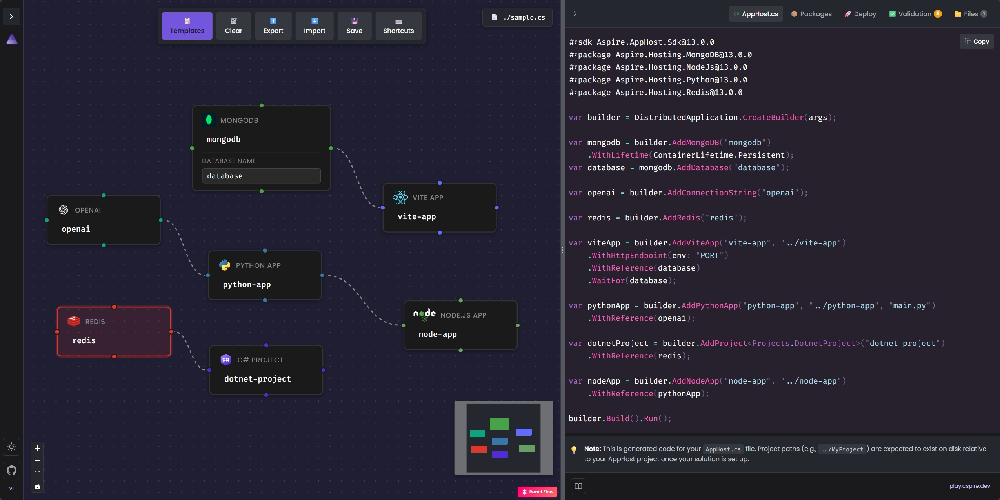
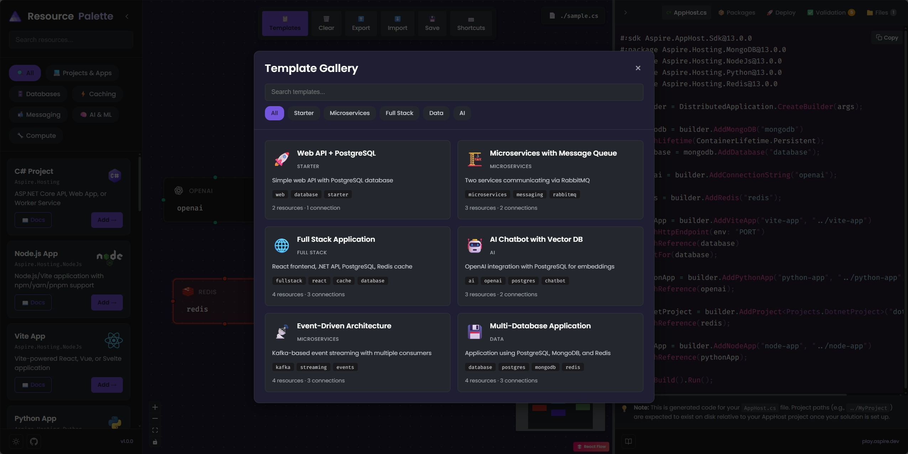

# Aspire Playground

A visual designer for [Aspire](https://aspire.dev) distributed applications. Build your cloud-native architectures by dragging and dropping resources, then export production-ready `AppHost.cs` code.

[](https://github.com/IEvangelist/play.aspire.dev/actions/workflows/build.yml) [](https://app.netlify.com/projects/playaspiredev/deploys)



## What is this?

Aspire Playground lets you visually design .NET Aspire applications without writing boilerplate code. Simply:

1. **Drag resources** onto the canvas (databases, caches, messaging, APIs)
2. **Connect them** to define dependencies
3. **Configure** each resource with environment variables, ports, and volumes
4. **Export** the generated `Program.cs` for your AppHost project

The generated code follows Aspire best practices and includes proper dependency ordering through topological sorting.

## Features

| Feature | Description |
|---------|-------------|
| 🎨 **Visual Canvas** | Drag-and-drop interface powered by React Flow |
| 📚 **18+ Resources** | Databases, caches, messaging, AI services, and more |
| ⚡ **Real-time Code Gen** | See your C# code update as you design |
| 📋 **Templates** | Start with pre-built patterns (microservices, full-stack, etc.) |
| ✅ **Validation** | Real-time architecture quality checks |
| 🌙 **Dark Theme** | Easy on the eyes, matches aspire.dev |

## Screenshots

### Resource Palette

Browse and search available Aspire resources by category.



### Code Generation

Real-time C# code generation with syntax highlighting.



### Configuration Panel

Configure resources with environment variables, ports, and more.


### Template Gallery

Start quickly with pre-built architecture patterns.



## Getting Started

### Run Locally

```bash
# Install dependencies
npm install

# Start dev server
npm run dev
```

Open [http://localhost:4321](http://localhost:4321) to start designing.

### Build for Production

```bash
npm run build
```

## Keyboard Shortcuts

| Shortcut | Action |
|----------|--------|
| `Delete` | Remove selected nodes/connections |
| `Ctrl+Z` | Undo |
| `Ctrl+Y` | Redo |
| `Ctrl+C` / `Ctrl+V` | Copy/Paste nodes |
| `Shift+Drag` | Snap to connected nodes |
| Double-click | Configure a resource |

## Tech Stack

- **React 19** + **TypeScript**
- **Vite** for builds
- **@xyflow/react** for the visual canvas
- **Shiki** for syntax highlighting
- **Tailwind CSS** for styling

## Contributing

Contributions are welcome! Please feel free to submit a Pull Request.

## Resources

- [aspire.dev](https://aspire.dev)
- [Aspire](https://github.com/dotnet/aspire)
- [Aspire Samples](https://github.com/dotnet/aspire-samples)

## License

MIT
